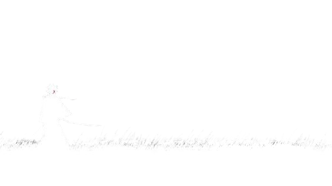

<p align="center">
  
</p>

<p align="center">
    
    
    
    
  </a>
  <a href="https://github.com/Mimifunk/deface-page">
    </a>
  </a> 

## 〢 :gear: How to install 
```bash
1. git clone https://github.com/Mimifunk/deface-page
```
## 〢 :bat: Preview
